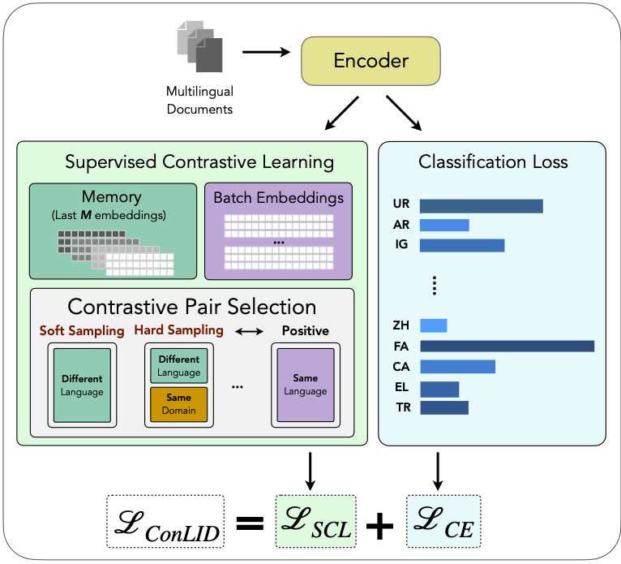

<p align="center">
  <a href="https://huggingface.co/epfl-nlp/ConLID">
    
  </a>
  <!-- <a href="https://arxiv.org/abs/your_arxiv_id_here">
    
  </a> -->
</p>

# Language Identification for 2000 languages: Optimized for low-resource langauges

<p align="center">
  
</p>

**TL;DR:** We introduce **ConLID**, a model trained on [GlotLID-C dataset](https://huggingface.co/datasets/cis-lmu/glotlid-corpus) using Supervised Contrastive Learning. It supports **2,099 languages** and is, especially, effective for **low-resource languages**.

### 🛠️ Setup
```bash
git clone https://github.com/epfl-nlp/ConLID.git
cd ConLID
# set the evironment variables as in `.env_example`
source setup.sh
```

### 🤖 Usage

**Download the model**
```python
from huggingface_hub import snapshot_download

snapshot_download(repo_id="epfl-nlp/ConLID", local_dir="checkpoint")
```

**Use the model**
```python
from model import ConLID
model = ConLID.from_pretrained(dir='checkpoint')

# print the supported labels
print(model.get_labels())
## ['aai_Latn', 'aak_Latn', 'aau_Latn', 'aaz_Latn', 'aba_Latn', ...]

# prediction
model.predict("The cat climbed onto the roof to enjoy the warm sunlight peacefully!")
# (['eng_Latn'], [0.970989465713501])

model.predict("The cat climbed onto the roof to enjoy the warm sunlight peacefully!", k=3)
## (['eng_Latn', 'sco_Latn', 'jam_Latn'], [0.970989465713501, 0.006496887654066086, 0.00487488554790616])
```


### 💪🏻 Training
**Download the train dataset under `data/glotlid/`**
```bash
huggingface-cli download cis-lmu/glotlid-corpus --repo-type dataset --local-dir data/glotlid
```

**Run data preprocessing pipeline**
```bash
bash scripts/preprocess_dataset.sh
```

**Run trainings**
```bash
bash scripts/train_lid_ce.sh    # Trains the LID-CE model
bash scripts/train_lid_scl.sh   # Trains the LID-SCL model
bash scripts/train_conlid_s.sh  # Trains the ConLID-S model
```

### 🎯 TODO
- [x] Release the inference code
- [x] Release the training code
- [ ] Release the evaluation code
- [ ] Optimize the inference using parallel tokenization
- [ ] Publish the preprint on arXiv
